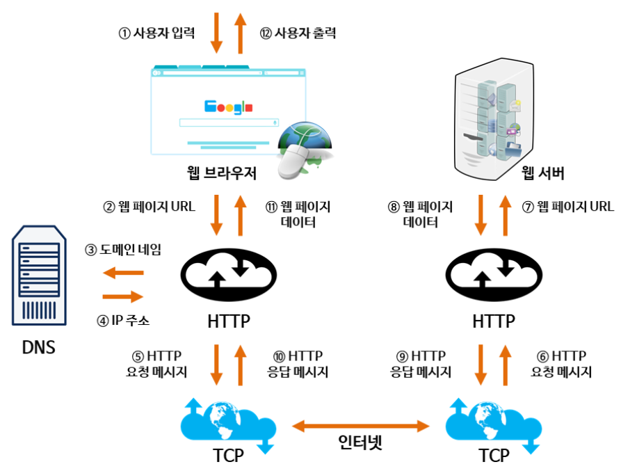

# 웹 프로세스

## 웹 서비스가 사용자에게 제공되는 프로세스란?

**클라이언트 서버(Client-Server) 네트워크**이란 여러개의 클라이언트가 네트워크 통신을 활용해 서버에 접속을 하고 그 서버와 붙어있는 데이터베이스를 활용할 수 있는 시스템을 말합니다. **서버**는 데이터베이스를 저장하고 DBMS를 운영하면서 여러 클라이언트에서 온 질의를 최적화, 권한 검사를 수행, 동시성제어, 회복기능, 무결성, 접근을 관리하고 클라이언트는 사용자 인터페이스를 관리하고 응용들을 수행합니다. **클라이언트**는 서버와 동일한 디바이스 일 수도 있지만 대부분 서비스를 사용하고자 하는 사용자가 지니고 있는 인터넷이 가능한 모든 디바이스를 클라이언트라고 지칭합니다. 

이렇게 하면 하드웨어 비용을 획기적으로 줄일 수 있습니다. 그리고 전세계 어디에서든지 접속이 가능한 인터넷이라는 매체의 특성상 지역에 제한을 받지 않게됩니다.

위의 사진처럼 웹 서비스는 크게 두 단계로 나뉜다.

여기서, url에 있는 문서를 찾아 보여주는 것이 서비스가 하고 있는 일이다.

1. 첫번째로 서버의 위치를 찾는 것이다.
   * 사용자가 검색한 Domain을 DNS 서버로 보내 DNS 서버에서 해당하는 IP를 받아오고 그 IP로 웹 서버에 접속을 한다.
2. 두번째로 문서의 위치를 찾는 것이다.
   * DNS에서 해당하는 IP를 받아와 웹 서버에 접속을 했으면 IP에 맞는(해당하는) 특정한 폴더에 있는 문서나 오브젝트(이미지 파일들..)을 Http/Https 통신 프로토콜을 사용해서 받아오는 것이다.

 
