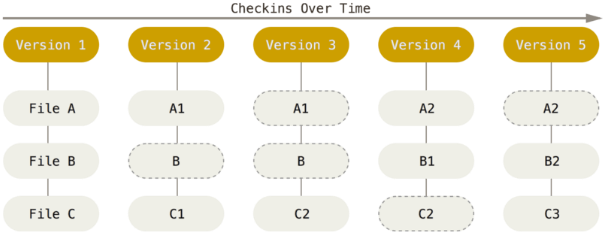
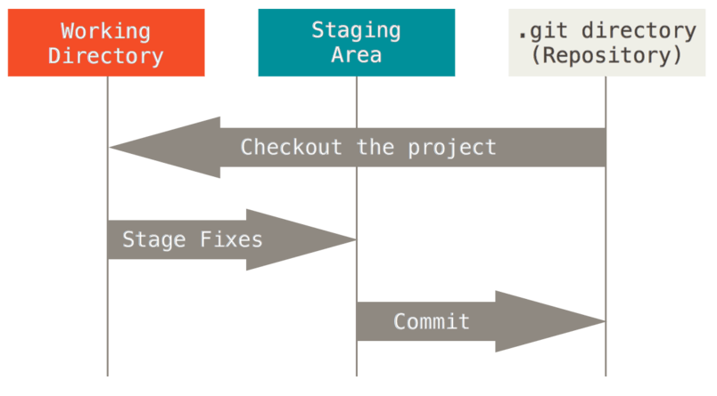
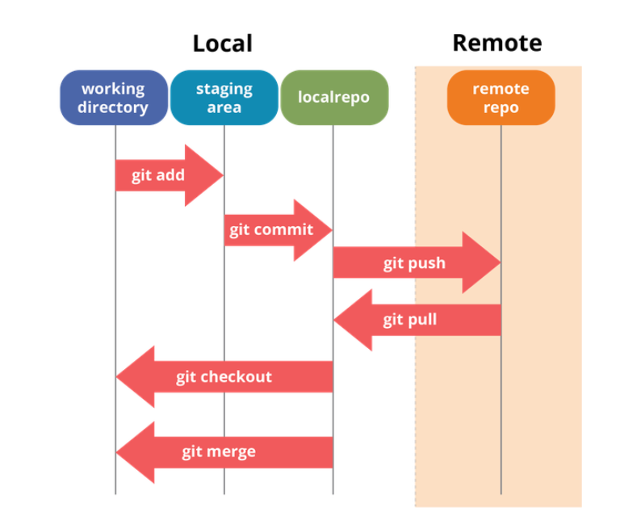
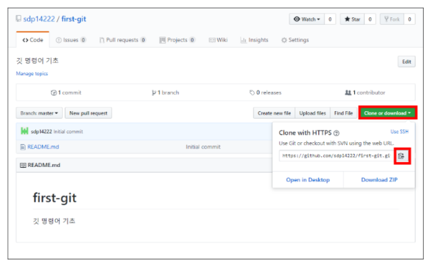
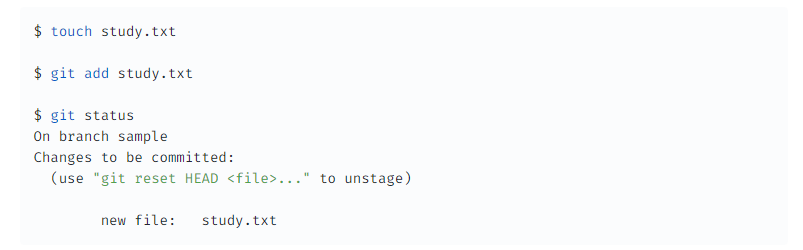
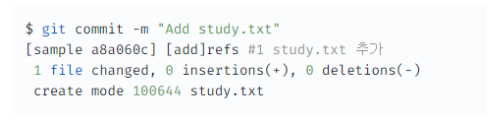
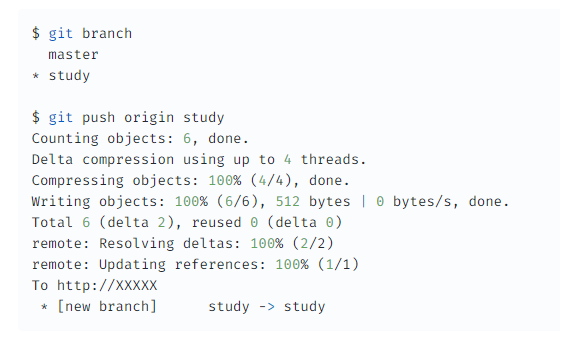

# GIT이란?

## GIT이란?

GIT is a free and open source distributed version control system designed to handle everything from small to very large projects with speed and efficiency.

GIT은 소규모에서 대규모 프로젝트에 이르기까지 모든 것을 빠르고 효율적으로 처리하도록 설계된 무료 오픈 소스 분산 버전 제어 시스텝이다.

GIT is easy to learn and has a tiny footprint with lightning fast performance.

GIT은 배우기 쉽고 매우 빠른 성능과 작은 설치 공간을 가지고 있다.

It outclasses SCM(Source Code Management) tools like Subversion, CVS, Perforce, and ClearCase with features like cheap local branching, convenient staging areas, and multiple workflows.

Subversion, CVS, Perforce 및 ClearCase와 같은 SCM 도구를 저렴한 로컬 분기, 편리한 스테이징 영역 및 여러 워크플로우와 같은 기능으로 능가한다.

* git을 사용해서 협업하는 프로그램
  - github은 SaaS 방법으로 gitlab을 제공
  - gitlab은 git으로 버전 컨트롤을 하고 gitlab으로 협업

 

## GIT | 특징 1 - 스냅샷 방식

Git은 데이터를 파일 시스템 스냅샷의 연속으로 취급하고 크기가 아주 작다. Git은 커밋하거나 프로젝트의 상태를 저장할때마다 파일이 존재하는 그 순간을 중요하게 여긴다. 파일이 달라지지 않았으면 Git은 성능을 위해서 파일을 새로 저장하지 않는다. 단지 이전 상태의 파일에 대한 링크만 저장한다. Git은 데이터를 스냅샷의 스트림처럼 취급한다.

Git은 문서의 버전을 자동으로 관리하고 매 순간순간 파일당이 아니라 작업당으로 스냅샷을 찍는다.

### \< 이전의 VCS 구조>

### \< Git의 VCS 구조 >

 

## GIT | 특징 2 - 로컬 분산 스토리지

거의 모든 명령이 로컬 파일과 데이터만 사용하기 때문에 네트워크에 있는 다른 컴퓨터는 필요 없다.

프로젝트의 모든 히스토리가 로컬 디스크에 있기 때문에 모든 명령이 순식간에 실행된다.

예를 들어, Git은 프로젝트의 히스토리를 조회할 때 서버 없이 조회한다. 그냥 로컬 데이터베이스에서 히스토리를 읽어서 보여준다. 그래서 눈 깜짝할 사이에 히스토리를 조회할 수 있다. 어떤 파일의 현재 버전과 한 달 전의 상태를 비교해보고 싶을 때도 Git은 그냥 한 달 전의 파일과 지금의 파일을 로컬에서 찾는다. 파일을 비교하기 위해 리모트에 있는 서버에 접근하고 나서 예전 버전을 가져올 필요가 없다.

즉, 오프라인 상태이거나 VPN에 연결하지 못해도 막힘 없이 일 할 수 있다. 비행기나 기차 등에서 작업하고 네트워크에 접속하고 있지 않아도 커밋할 수 있다.

**중앙 저장소에 Push하거나, Pull 할 때만 네트워크 연결이 필요하다.**

 

## GIT | 특징 3 - 데이터 무결성

Git은 데이터를 저장하기 전에 항상 체크섬을 구하고 그 체크섬으로 데이터를 관리한다. 그래서 체크섬을 이해하는 Git 없이는 어떠한 파일이나 디렉토리도 변경할 수 없다. 체크섬은 Git에서 사용하는 가장 기본적인(Atomic) 데이터 단위이자 Git의 기본 철학이다. Git 없이는 체크섬을 다룰 수 없어서 파일의 상태도 알 수 없고 심지어 데이터를 잃어버릴 수도 없다.

Git은 SHA-1 해시를 사용하여 체크섬을 만든다. 만든 체크섬은 40자 길이의 16진수 문자열이다. 파일의 내용이나 디렉토리 구조를 이용하여 체크섬을 구한다. SHA-1은 아래처럼 생겼다.

#### Git 체크섭 예)
24b9da6552252987aa493b52f8696cd6d3b00373

#### Git은 데이터를 추가할 뿐 ----
Git으로 무얼 하든 Git 데이터베이스에 데이터가 추가 된다. 되돌리거나 데이터를 삭제할 방법이 없다. 다른 VCS처럼 Git도 커밋하지 않으면 변경사항을 잃어버릴 수 있다. 하지만, 일단 스냅샷을 커밋하고나면 데이터를 잃어버리기 어렵다.

 

## GIT | Staging Area

Staging Area는 Git 디렉토리에 있다. 단순한 파일이고 곧 커밋할 파일에 대한 정보를 저장한다. Git에서는 기술용어로는 "Index"라고 하지만, "Staging Area"라는 용어를 써도 상관 없다.

Staging Area는 곧 커밋할 파일에 대한 정보를 저장한다. 자동으로 깃이 변경 내용을 추적한다.

Git으로 하는 일은 기본적으로 아래와 같다.

1. 워킹 트리에서 파일을 수정한다.
2. Staging Area에 파일을 Stage 해서 커밋할 스냅샷을 만든다. 모든 파일을 추가할 수도 있고 선택하여 추가할 수도 있다.
3. Staging Area에 있는 파일들을 커밋해서 Git 디렉토리에 영구적인 스냅샷으로 저장한다.

 

## GIT | Deploy & Sync Flow

 

## GIT | Git의 주요 명령어

* git clone \<url>
  * remote repository를 local에 다운로드
  * remote branch 상에 복수의 브랜치가 존재하는 경우는 모든 브랜치를 일괄 다운로드
  * remote repository의 URL은 아래 화면처럼 웹 화면에서 취득 가능하다.
  * 

* git status : 이전 커밋과 비교해서 변경 내용을 표시
* git add : working director 상의 편집, 추가한 파일을 stage area에 추가
* 

* git commit 
  * 보통 git commit -m "커밋 내용"의 형태로 CLI에서 실시
  * commit message를 적는 방법은 팀에 따라 상이하다.
  * 

* git push
  * local repository 브랜치를 remote repo에 업로드
  * git push -f 옵션으로 강제 push도 가능 (rebase 후에는 -f 옵션 필요)
  * 

* git pull & git fetch
  * 원격 저장소에서 로컬 저장소로 소스를 가져오는 명령어로는 pull과 fetch가 있다. fetch와 pull의 차이는 가져온 소스를 merge 하느냐 안하느냐의 차이다.
  * pull 명령어는 원격 저장소의 소스를 가져오고 해당 소스가 현재 내 소스보다 더 최신 버전이라고 하면 지금의 버전을 해당 소스에 맞춰 올린다. merge 명령어를 사용하는 것이다.
  * 하지만 fetch의 경우 단지 소스를 가져올 뿐 merge 하지는 않는다.

 

## ⚡ 참조
* <https://git-scm.com/>
* <https://backlog.com/git-tutorial/kr/>

 
