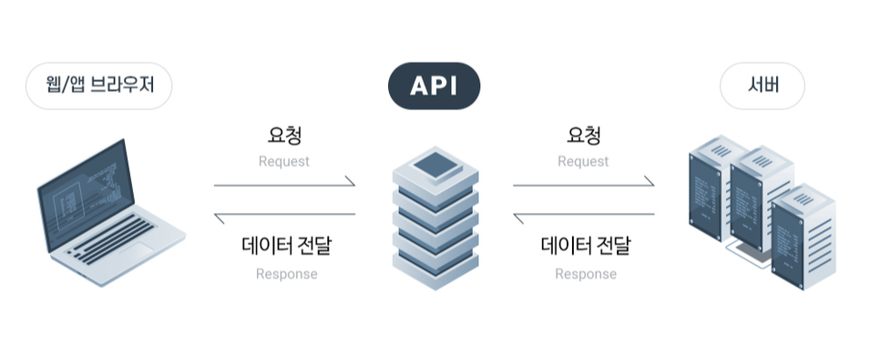

# API란?

## API(Application Programming Interface)란?

**" 서로 다른 애플리케이션이 데이터를 어떻게 주고받을 것인가? "**

API는 Application Programming Interface의 약자로 한 애플리케이션이 다른 애플리케이션의 기능이나 데이터를 쉽게 사용할 수 있게 하는 인터페이스이다. 쉽게 말하자면 API는 방대한 데이터를 표준화하고 프로그래밍해서 외부 개발자들이 쉽게 서비스나 애플리케이션을 개발할 수 있게 해주는 제작도구다. 애플리케이션 로직과 데이터의 안정적이고 간편한 진입점을 정의하여 개발자가 다른 개발자가 빌드한 애플리케이션 로직에 쉽게 액세스 하고 재사용할 수 있게 해주는 것이다. 다른 말로는 웹기반 데이터 반환 시스템이라 할 수 있으며 데이터베이스나 서버로 쉽게 접근할 수 있도록 많은 함수들을 관리하는 코드라고 이해할 수 있다.

 

## API는 왜 필요할까?

웹서비스 개발 시에는 Back-end 개발자가 서버 구축 및 API 개발을 완성하면 Front-end 개발 인력이 정해진 API 함수를 통해 DB에 있는 원하는 데이터를 쉽게 호출하여 사용할 수 있다. 이처럼 응용 프로그램 개발자들이 프로그래밍을 할 때 개발하는 운영 체제에서 실제 동작하는 프로그램을 비교적 쉽게 만들 수 있기 때문에 여러 인터페이스와 함수를 모아놓은 API가 사용되고 있다.

 

## Open API란?

Open API(Open Application Programming Interface)란 개발자라면 누구나 사용할 수 있도록 공개된 API를 말하며, 개발자에게 사유 응용 소프트웨어나 웹 서비스의 프로그래밍 적인 권한을 제공한다.

최근 웹이나 앱 사용을 위한 회원가입 시 KAKAO나 Facebook 등 간편 로그인이라는 기능이 생겼다. Kakao 또는 Facebook에 이미 저장되어 있는 가입자의 고유 정보들을 Kakao나 Facebook에 직접 접속하지 않고도 외부로 정보 접근이 가능하도록 API형태로 개발하여 배포를 하기 때문에 활용할 수 있다. 따라서 요청하는 서버 데이터를 API 함수 호출을 통해서 전달받은 후 신규 서비스에 적용하여 편리하게 사용할 수 있는 것이다. 우리는 Kakao 로그인 API, Facebook 로그인 API라고 칭하고 있다. 아래 Open API 예제를 더 알아보자!!

- 대표적인 예로 네이버 지도, 구글맵, 오픈스트리트맵 등이 대표적인 예이다. 지도 서비스 및 다양한 서비스들에서 시도되고 있으며 누구나 접근하여 사용할 수 있다.
- 메타블로그도 Open API를 사용하여 만들었다.
- 최근에 코로나 사태로 라이브코로나, 코로나맵등의 서비스가 생겼었는데 네이버 클라우드 플랫폼의 API 지원을 받고 있다.
- 대한민국 정부에서는 공공데이터포털을 통해 도로명 주소 조회 서비스, 동네예보정보조회서비스등 오픈 API를 운영 및 제공하고 있다.

 

## Restful API (Representational State Transfer)란?

 

## API와 JSON과의 관계

API는 현재 가장 많이 사용하고 있는 데이터 교환 양식이다. API를 만들때 JSON으로 넘겨줄 거냐 XML으로 넘겨줄 거냐 라는 고민을 한다. 여기서 JSON이 무엇인가 하면 흔히 개발된 API를 JSON 또는 XML 형식으로 호출하여 파싱 한다는 표현을 사용한다. JSON은 JavaScript Object Notation의 줄임말로 JavaScript 객체들을 나타내는 데이터의 대표적인 표현 기법이다.

 

## ⚡ 참조

- <https://aws.amazon.com/ko/what-is/api/>
- <https://www.redhat.com/ko/topics/api/what-are-application-programming-interfaces>
- <https://blog.naver.com/freemoa1/222047570809>

 
