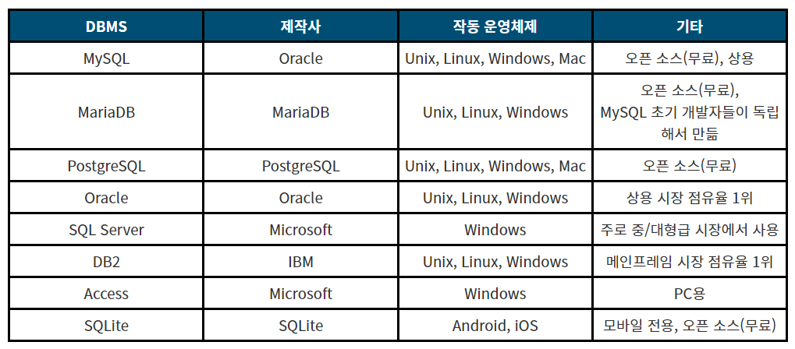

# DBMS란?

## 1. DB(Database, 데이터베이스)

데이터베이스는 여러 사람이 공유하여 사용할 목적으로 체계화해 통합, 관리하는 데이터의 집합니다. 
 
### 1-1. DB의 특징
 - 실시간 접근성(Real-time Accessability) : 사용자의 요구(query)를 실시간으로 처리하여 응답한다.
 - 계속적인 진화(Continuous Evolution) : 정확한 값을 유지하기 위해 삽입, 삭제, 갱신(수정) 등의 동적인 작업을 통해 데이터를 지속적으로 갱신할 수 있다.
 - 동시 공유(Concurrent Sharing) : 여러 사용자가 동시에 원하는 데이터를 공유할 수 있다.
 - 내용에 의한 참조(Content Reference) : 저장한 데이터 레코드의 위치나 주소가 아닌 사용자가 요구하는 데이터의 내용, 즉 데이터 값에 따라 참조할 수 있어야 한다.
 - 데이터 논리적 독립성(Independence) : 응용프로그램과 데이터베이스를 독립시킴으로써 데이터 논리적 구조를 변경시키더라도 응용프로그램은 변경되지 않는다.

### 1-2. DB의 장점
 - 데이터 중복 최소화
 - 데이터 공유
 - 일관성, 무결성, 보안성 유지
 - 데이터의 표준화 가능
 - 데이터의 논리적, 물리적 독립성
 - 용이한 데이터 접근
 - 데이터 저장 공간 절약

 

## 2. DBMS(Database Management System, 데이터베이스 관리 시스템)

데이터베이스를 생성 및 관리하며 응용 프로그램들이 데이터 베이스를 공유하며 사용할 수 있는 환경을 제공하는 소프트웨어이다. 데이터베이스를 구축하는 틀을 제공하고, 효율적으로 데이터를 검색하고 저장하는 기능을 제공한다. 또한 응용 프로그램들이 데이터베이스에 접근할 수 있는 인터페이스를 제공한다. dbms는 사용자 또는 다른 프로그램의 요구를 처리하고 적절히 응답하여 데이터를 사용할 수 있도록 해준다.

### 2-1. DBMS의  기능
 - 정의 : 데이터에 대한 형식, 구조, 제약조건들을 명세하는 기능이다. 데이터베이스에 대한 정의 및 설명은 카탈로그나 사전의 형태로 저장된다.
 - 구축 : DBMS가 관리하는 기억 장치에 데이터를 저장하는 기능이다.
 - 조작 : 특정한 데이터를 검색하기 위한 질의, 데이터베이스의 갱신, 보고서 생성 기능 등을 포함한다.
 - 공유 : 여러 사용자와 프로그램이 데이터베이스에 동시에 접근하도록 하는 기능이다.
 - 보호 : 하드웨어나 소프트웨어의 오동작 또는 권한이 없는 악의적인 접근으로부터 시스템을 보호한다.
 - 유지보수 : 시간이 지남에 따라 변화하는 요구사항을 반영할 수 있도록 하는 기능이다.

### 2-2. DBMS의 장단점
 - 장점
   - 데이터 중복 최소화
   - 데이터의 일관성 및 무결성 유지
   - 데이터 보안 보장
 - 단점
   - 운영비가 비싸다.
   - 백업 및 복구에 대한 관리가 복잡하다.
   - 부분적 데이터베이스 손실이 전체 시스템을 정지한다.

### 2-3. DBMS의 종류
*https://hongong.hanbit.co.kr/데이터베이스-이해하기-databasedb-dbms-sql의-개념/*

### 2-4. DBMS의 분류
 - 계층형(Hierarchical)
 - 망형(Network)
 - 관계형(Relational)
 - 객체지향형(Object-Oriented)
 - 객체관계형(Object-Relational)
 - 현재 사용되는 DBMS 중에는 관계형 DBMS가 가장 많은 부분을 차지하며, MySQL도 관계형 DBMS에 포함된다.

 

## 3. RDBMS(Relational Database Management System)

 - mysql뿐만 아니라 대부분의 dbms가 rdbms 형태로 사용된다.
 - rdbms의 데이터 베이스는 테이블(table)이라는 최소 단위로 구성되며,
 - 이 테이블은 하나 이상의 열(column)과 행(row)으로 이루어져 있다.
 - 즉, 모든 데이터가 테이블에 저장된다. 
 - 테이블 간의 관계는 일대일(1:1) 일 대 다(1:N) 다 대 다(N:N)의 관계가 있다.

 

## 4. SQL(Structured Query Language)

RDBMS를 관리하기 위해 설계된 특수 목적의 프로그래밍 언어이다.

RDBMS에서 자료의 검색과 관리, 데이터베이스 스키마 생성과 수정, 데이터베이스 객체 접근 조정 관리를 위해 고안됐다.

예시로는 MySQL, Oracle Database, DB2 등이 있다.

 

## 5. noSQL(Not Only SQL, 비관계형 데이터베이스)

rdb 형태의 관계형 데이터베이스가 아닌 다른 형태의 데이터 저장방식이다.

예시로는 mongoDB, redis, JSON, XML 등이 있다.

 - noSQL에서는 RDBMS와는 달리 테이블 간 관계를 정의하지 않음.
 - noSQL은 대량 데이터 처리할때 빠른 성능을 요구할때 사용하고, RDBMS는 중요한 트렌젝션처리(금융)가 요구되는 경우에 사용한다고 한다.
 - noSQL은 클라우드 환경에 맞는 저장 기술이라고 볼 수 있고, RDBMS가 클라이언트/서버 환경에 맞는 데이터 저장기술이다.

 

## ⚡ 참조 
 - <a href="https://hongong.hanbit.co.kr/데이터베이스-이해하기-databasedb-dbms-sql의-개념/">https://hongong.hanbit.co.kr/데이터베이스-이해하기-databasedb-dbms-sql의-개념/</a>
 - <a href="https://m.blog.naver.com/sundooedu/221301384166">https://m.blog.naver.com/sundooedu/221301384166</a>
 - <a href="https://0ver-grow.tistory.com/192">https://0ver-grow.tistory.com/192</a>
 - <a href="https://im-designloper.tistory.com/67">https://im-designloper.tistory.com/67</a>

  
 