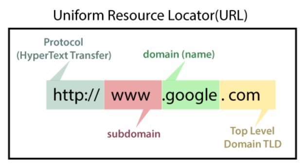
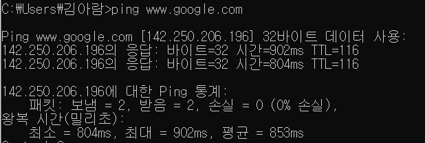
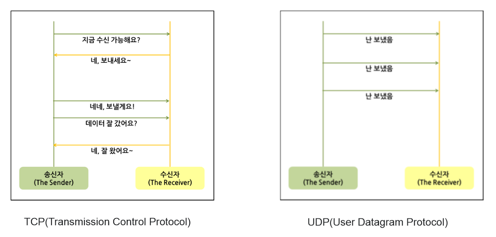

# URL, Protocol, TCP/IP이란?

## URL(Uniform Resource Locator)

*https://www.javatpoint.com/what-is-domain*

* 접속 주소 : www.google.com -> 142.250.206.196
* Protocol : http/https 지원하는지 안하는지 확인 필요
  - 웹 서버 : http 또는 https를 통해 웹 브라우저에서 요청하는 HTML문서나 오브젝트(이미지 파일등)을 전송해주는 서비스 프로그램
* 포트 : 80(http default), 443(https default) 할당이 되어 있는지

 

## Protocol

통신 프로토콜 또는 통신 규약이란 컴퓨터들 간의 원활한 통신을 위해 지키기로 약속한 규약이다. 즉, 컴퓨터나 원거리 통신 장비 사이에서 메시지를 주고 받는 양식과 규칙의 체계이다.

프로토콜은 형식, 의미론, 그리고 통신의 동기 과정 등을 정의하기는 하지만 구현되는 방법이 독립적이다. 즉 프로토콜은 하드웨어 또는 소프트웨어 그리고 때로는 모두를 사용하여 구현되기도 한다.

프로토콜에는 신호 처리법, 오류감지 및 수정, 암호, 인증, 주소 등을 포함한다.

인터넷이 전 세계에 연결되어 자유롭게 사용이 가능한 것은 프로토콜 덕분이다. 인터넷은 TCP/IP 기반하에 동작하는데 이 자체가 프로토콜이다. 원활한 통신을 위해서는 반드시 프로토콜을 통일시켜야 한다. 그래서 전세계에서 쓰이는 프로토콜을 통합시킨 국제 표준 통신규약이 존재한다. 

* 인터넷을 통해서 전 세계로 이메일을 보낼 수 있는 것은 SMTP(Simple Main Transfer Protocol)라는게 규정되어 있고 전세계의 메일 서버가 이를 따른다.
* 월드 와이드 웹 역시 HTTP(HyperText Transfer Protocol)이라는 것이 규정되어 있고, 웹 서버와 웹 브라우저가 이를 따르기 때문에 가능한 것이다.

 

## TCP vs UDP

* TCP/IP의 전송계층에서 사용퇴는 프로토콜이다. 전송계층은 IP에 의해 전달되는 패킷의 오류를 검사하고 재전송 요구 등의 제어를 담당하는 계층이다.
* TCP와 UDP 둘다 포트 번호를 이용하여 주소를 지정하고, 데이터 오류 검사를 위한 체크섬이 존재한다.
* TCP(Transmission Control Protocol, 전송 제어 프로토콜)
  - 연결이 성공해야 통신이 가능하다. (연결형 프로토콜)
  - 데이터의 경계를 구분하지 않는다. (Byte-Stream Service)
  - 신뢰성 있는 데이터를 전송한다. (데이터의 재전송 존재)
  - 일 대 일(Unicase) 통신이다.
  - 전송 데이터의 크기가 무제한이다.
  - 패킷에 대한 응답을 해야하기 때문에(시간 지연, CPU 소모) 성능이 낮다.
  - Streaming 서비스에 불리하다. (손실된 경우 재전송 요청을 하기 때문이다)
  - 인터넷에 사용된다.
* UDP(User Datagram Protocol)
  - 비연결형 프로토콜이다. (연결 없이 통신이 가능)
  - 데이터의 경계를 구분한다. (Datagram Service)
  - 비신뢰성 있는 데이터를 전송한다. (데이터의 재전송 없음)
  - 일 대 일, 일 대 다(Broadcast), 다 대 다(Multicast) 통신이다.
  - 정보를 주고 받을 때 정보르 보내거나 받는다는 신호 절차를 거치지 않는다.
  - TCP보다 속도가 빠르다.
  - 속도가 빠르기 때문에 게임에 사용된다.
* ⚡ 참조
  - <https://velog.io/@hidaehyunlee/TCP-와-UDP-의-차이>
  - <https://mangkyu.tistory.com/15>

*https://velog.io/@hidaehyunlee/TCP-와-UDP-의-차이*

 

## IP (Internet Protocol) vs IP Address (Internet Protocol Address)

* 인터넷 프로토콜(IP, Internet Protocol)은 송신 호스트와 수신 호스트가 패킷 교환 네트워크(패킷 스위칭 네트워크, Packet Switching Network)에서 정보를 주고받는 데 사용하는 정보 위주의 규약(프로토콜, Protocol)이며, OSI 네트워크 계층에서 호스트의 주소지정과 패킷 분할 및 조립 기능을 담당한다. 줄여서 아이피(IP)라고도 한다.
* IP는 비신뢰성(unreliability)과 비연결성(connectionlessness)이 특징이다. 비신뢰성은 흐름에 관여하지 않기 때문에 보낸 정보가 제대로 갔는지 보장하지 않는다는 뜻이다. 예를 들어 전송 과정에서 패킷이 손상될 수도 있고, 같은 호스트에서 전송한 패킷의 순서가 뒤죽박죽이 될 수도 있고, 같은 패킷이 두 번 전송될 수도 있으며, 아예 패킷이 사라질 수도 있다. 패킷 전송과 정확한 순서를 보장하려면 TCP 프로토콜과 같은 IP의 상위 프로토코을 이용해야 한다.

* IP (Internet Protocol)
  - 패킷 교환 네트워크
  - 인터넷이 통하는 네트워크에서 어떤 정보를 수신하고 송신하는 통신에 대한 규약을 의미한다.
  - OSI 네트워크 계층에서 호스트의 주소 지정과 패킷 분할 및 조립 기능을 담당한다.
  - OSI의 layer 3(Network Layer)와 Internet Protocol Suite의 Layer 3(Internet Layer)에 위치하는 프로토콜이다.
* IP Address (Internet Protocol Address)
  - 컴퓨터 네트워크에서 장치들이 서로를 인식하고 통신을 하기 위해서 사용하는 특수한 번호이다.
  - 네트워크에 연결된 장치가 라우터이든 일반 서버이든, 모든 기계는 이 특수한 번호를 가지고 있어야 한다. 이 번호를 이용하여 발신자를 대신하여 메시지가 전송되고 수신자를 향하여 예정된 목적지로 전달된다.
  - 우리가 일반적으로 말하는 ip는 ip주소를 뜻하기도 한다.

 
