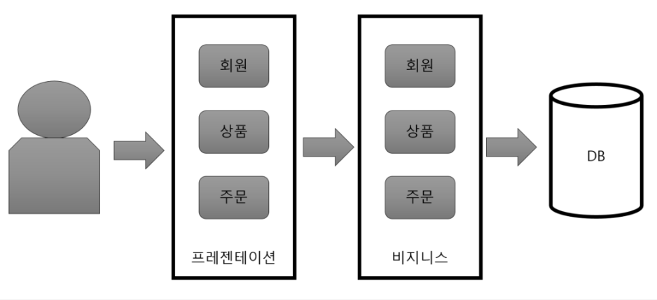
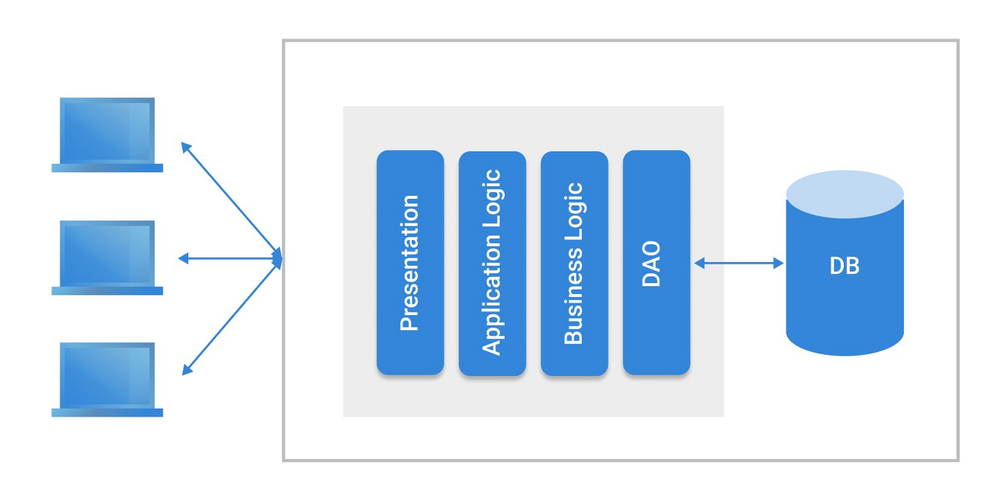
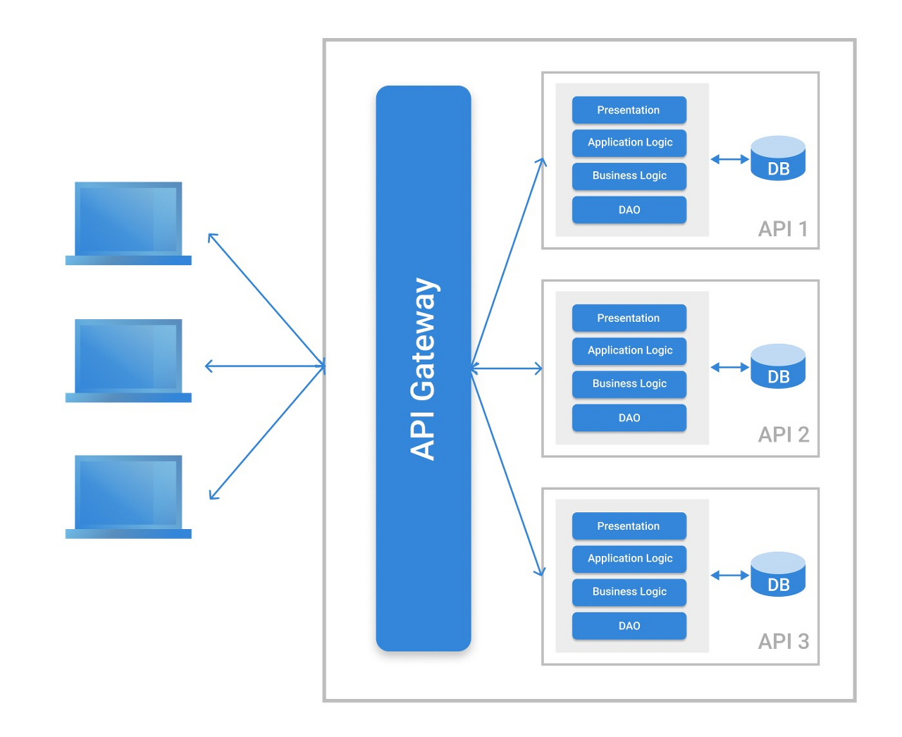

# MSA란?

## Monolithic Architecture

*http://clipsoft.co.kr/wp/blog/마이크로서비스-아키텍처msa-개념/*

*https://steady-coding.tistory.com/595*

모놀리식 아키텍처는 마이크로서비스(MSA) 아키텍처에 반대되는 개념으로, 애플리케이션의 모든 구성 요소가 한 프로젝트에 통합되어 있는 형태를 말한다. 전체 애플리케이션이 하나로 되어있어서 보통 동일한 개발 툴을 사용해 개발되며, 베포 및 테스트도 하나의 애플리케이션만 수행하면 되기 때문에 개발 및 환경설정이 간단하다. 또한 각 컴포넌트들이 함수로 호출되기때문에 성능에 제약이 덜하고 운영 관리가 용이하다. 이런 장점때문에 작은 볼륨의 시스템을 개발할 때는 매우 유용하지만 시스템이 커지고 시작하고 여러 컴포넌트들이 더해지며 문제가 발생한다.

* 장점
  - 개발 초기에 단순한 아키텍처 구조로 인해 개발에 용이하다.
  - 어떤 서비스든지 개발되어 있는 환경이 같아서 복잡하지 않다.
  - 배포가 간단하다.
  - 확장성이 쉽다.
  - 쉽게 고강요성 서버 환경을 만들 수 있다.
  - End-to-End 테스트가 용이하다.
  - 빌드/테스트 시간이 길어진다.
  - 선택적 확장이 불가능하다.
  - 하나의 서비스가 모든 서비스에 영향을 준다.
* 단점
  - 프로젝트의 규모가 커짐에 따라 애플리케이션 구동 시간이 늘어나고 빌드 및 배포 시간이 길어진다.
  - 조그마한 수정 사항이 있어도 전체를 다시 빌드하고 배포해야 한다.
  - 많은 양의 코드가 몰려 있어서 개발자가 모든 코드를 이해하기 힘들며 유지 보수가 어렵다.
  - 일부분의 오류가 전체에 영향을 미친다.
  - 기술 스택이 한 번 정해지면 바꾸기 어렵다.
  - 전체 애플리케이션 확장은 쉽지만, 부하 분산을 위해 각 컴포넌트를 독립적으로 확장하기 어렵다.

 

## MSA (Micro Service Architecture)

*http://clipsoft.co.kr/wp/blog/마이크로서비스-아키텍처msa-개념/*

*https://steady-coding.tistory.com/595*

단일 프로그램을 각 컴포넌트 별로 나누어 작은 서비스의 조합으로 구축하는 방법이다. 다른 말로 하나의 큰 애플리케이션을 여러 개의 작은 애플리케이션으로 쪼개어 변경과 조합이 가능하도록 만든 형태를 말한다. 아직까지는 많은 소프트웨어가 Monolithic 형태로 구현되어 있고, 소규모 프로젝트에는 Monolithic Architecture가 훨씬 합리적인데 간단한 Architecture이고 유지보수가 용이하기 때문이다. 하지만 규모가 커지고 많은 개발자가 투입되는 프로젝트 및 서비스에서는 Monolithic Architecture은 한계가 되서 MSA가 필요한 이유이다. 서비스나 프로젝트가 크고, 복잡하고, 장기적으로 운영될수록, MSA의 장점이 더욱 드러난다.

* 장점
  - 서비스 별 개별 배포가 가능하며 독립 배포가 가능하므로 개발자의 자율성이 증가하다.
  - 요구 사항을 신속하게 반영하여 빠르게 배포할 수 있다.
  - 특정 서비스에 대한 확장성이 용이하다. 특히, 클라우드 사용에 적합하다.
  - 장애가 전체 서비스로 확장될 가능성이 적다. 서비스 별이라 부분적 장애에 대한 격리가 수월하다.
  - 팀 별로 프로젝트가 분리되어 있으므로 코드의 이해도가 증가하고, 그에 때라 유지 보수하기 쉽다.
* 단점
  - 아키텍처가 다소 복잡하므로 개발 및 관리가 어렵고, 비용이 많이 든다.
  - 데이터가 여러 서비스에 걸쳐서 분산되므로 한 번에 조회하기 어렵고, 데이터의 정합성 또한 관리하기 어렵다.
  - 단위 테스트는 쉽지만, 통합 테스트 및 End-to-End 테스트 단위로 들어가면 여러 서비스 간 호출 시 API를 사용하기 때문에 통신 비용 및 지연 시간이 증가한다.
  - 각 서비스 별로 데이터베이스가 있으므로 트랜젝션을 구현하기 까다롭다.

 

## ⚡ 참조 
* <a href="https://steady-coding.tistory.com/595">https://steady-coding.tistory.com/595</a>

 
