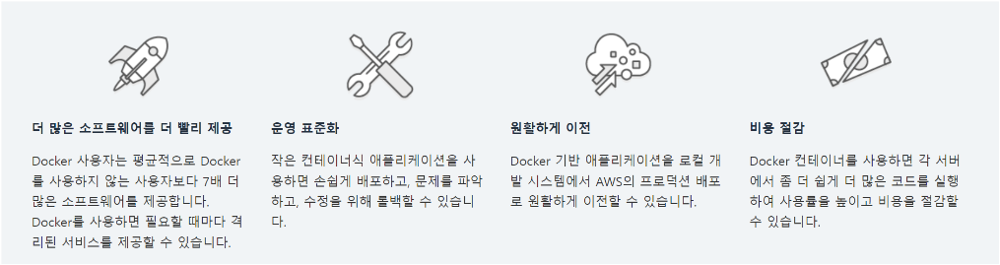
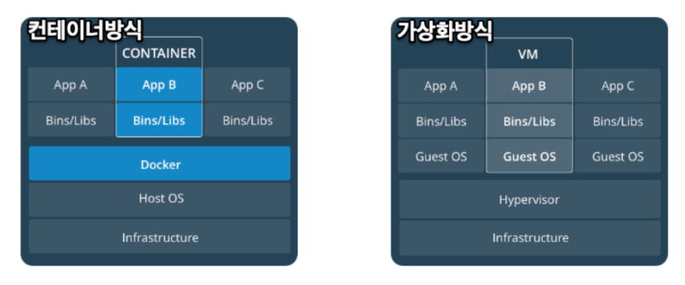
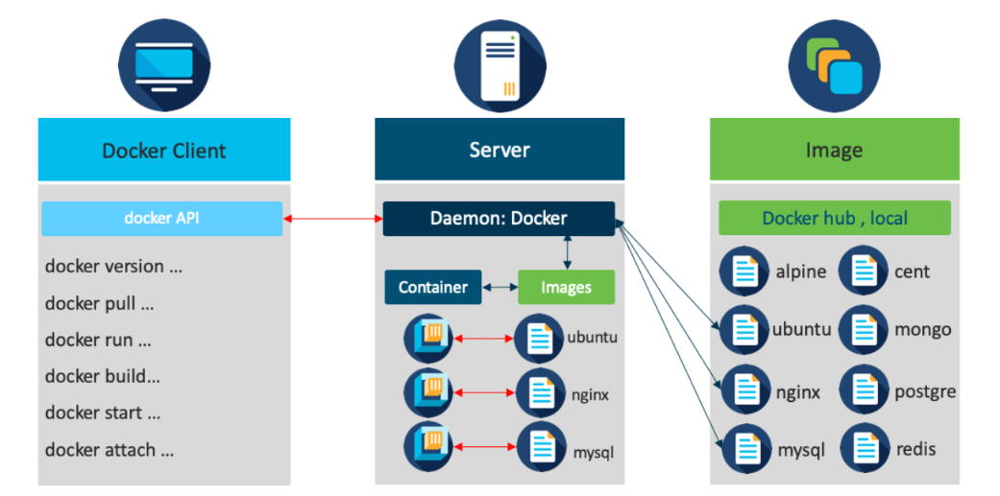

# Docker란?

## Docker란?

Docker는 애플리케이션을 신속하게 구축, 테스트 및 배포할 수 있는 소프트웨어 플랫폼이다.

Docker는 소프트웨어를 컨테이너라는 표준화된 유닛으로 패키징하며, 이 컨테이너에는 라이브러리, 시스템 도구, 코드, 런타임 등 소프트웨어를 실행하는 데 필요한 모든 것이 포함되어 있다. Docker를 사용하면 환경에 구애받지 않고 애플리케이션을 신속하게 배포 및 확장할 수 있으며 코드가 문제없이 실행될 것임을 확신할 수 있다.

 

## Docker를 사용해야 하는 이유

Docker를 사용하면 코드를 더 빨리 전달하고, 애플리케이션 운영을 표준화하고, 코드를 원활하게 이동하고, 리소스 사용률을 높여 비용을 절감할 수 있다.

 

## Docker | 컨테이너

컨테이너는 이미지를 실행하여 시작이 된다. 

이미지는 코드, 런타임, 라이브러리, 환경 변수 및 구성 파일, 어플리케이션 등을 실행하는 데 필요한 모든 것을 포함하는 실행가능한 패키지이다.

컨테이너는 이미지의 런타임 인스턴스 단위이며, 이미지가 컨테이너로 실행이 될 때 메모리로 로딩이 된다.

이러한 이미지의 개념은 컨테이너를 구성하는데 있어서 매우 중요한 컨셉이다.

조금 더 쉽게 풀어서 생각해보면 도커에서 말하는 이미지는 컨테이너를 생성하게 하는 설계도 개념으로 보아도 무방하다.

안을 조금 더 들여다보면 도커의 이미지는 기본 이미지라고 하는 베이스 이미지와 자신이 필요한 어플리케이션, 라이브러리를 포함하는 이미지로 논리적으로 구분지을 수 있는데, 구분의 경계는 모호하다.

예를 들면 우분투 베이스 이미지에 nginx를 포함시켜 새롭게 베이스 이미지로 만들 수 있기 때문에 논리적으로만 이해하는 것이 편하다.

 

## Docker | 컨테이너 및 가상화 머신

컨테이너의 동작 방식은 여러개의 컨테이너들이 같은 호스트 시스템의 커널을 공유하는 방식이다.

이러한 방식은 가상화 기반의 방식에 비해서 메모리를 경량화 시킬 수 있고, 별도의 프로세스를 실행하는 방식을 사용한다.

이에 비해 많이 비교되는 가상화 방식은 하이퍼바이져를 통해 호스트 리소스에 대한 제어권을 소유하는 방식이다.

하이퍼바이저 방식에 따라 Type1, Type2를 통해 구현하는 방식이 다르긴 하지만, 별도의 운영체제를 구현해야 하고, 대부분 별도의 가상머신과 운영체제에서 어플리케이션을 동작하는 방식으로 디자인이 된다.

이러한 방식은 컨테이너 방식보다 많은 메모리와 자원을 소모하게 된다.

 

## Docker | 동작 구조

 

## Docker | ⚡ 참고
* Docker 소프트웨어 : <a href="https://www.docker.com/">https://www.docker.com/</a>
* Docker 오픈소스 커뮤니티 : <a href="https://forums.docker.com/">https://forums.docker.com/</a>
* Docker Hub : <a href="https://hub.docker.com/">https://hub.docker.com/</a>
* <a href="https://khj93.tistory.com/entry/Docker-Docker-%EA%B0%9C%EB%85%90">https://khj93.tistory.com/entry/Docker-Docker-%EA%B0%9C%EB%85%90</a>

 
