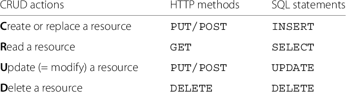

# HTTP METHOD와 응답코드

## HTTP METHOD의 종류

* **GET** : 서버에게 Resource를 보내도록 요청하는데 사용한다. (서버의 Resource를 읽음)
* **POST** : Server에 Input Data를 보내는 데 사용한다. (HTML form에 많이 사용)
* **HEAD** : GET과 동일하지만 서버에서 Body를 Return 하지 않는다.
  * Resource를 받지 않고 오직 찾기만 원할 때
  * object가 존재할 경우 응답의 상태 코드를 확인할 때
  * 서버의 응답 헤더를 봄으로써 Resource가 수정되었는지 확인
* **PUT** : 서버에 문서를 쓸때 사용한다. (GET과 반대)
  - PUT 메소드는 서버가 Client 요청의 Body를 확인
  - 요청된 URL에 정의된 새로운 Resource를 생성하기 위함
  - 요청된 URL이 존재할 경우 대체하여 사용
  - PUT vs POST
    - PUT은 서버의 Reource에 Data를 저장하기 위한 용도
    - POST는 서버에 DATA를 보내기 위한 용도
* **TRACE** : Client로부터 Request Packet이 방화벽, Proxy Server, Gateway 등을 거치면서 packet의 변조가 일어날 수 있는데, 이 때 Server에 도달했을 때의 최종 Packet의 Request Packet을 볼 수 있다.
* **OPTION** : Target Server의 지원 가능한 method (ex> GET, POST ...)를 알아 본다.
* **DELET** : 요청 Resource를 삭제하도록 요청한다.
  - 그러나!! HTTP 규격에는 Client의 요청에도 서버가 무효화 시킬수있도록 정의되어 있다.
  - DELETE Method는 항상 보장되지 않는다.

 

## CRUD (데이터 처리) vs HTTP method

* create - post ( 서버에 저장, 생성 / 무조건 서버가 작동 )
* read - get   ( parameter를 보내는 것은 검색 조건이다. 서버에 저장하는 것이 아니다. )
* update(=modify) - put   ( 신규로 생성하는 것이 아닐 때 사용, 서버가 한번 거르고 작동 )
* delete(=remove) - del   ( 삭제 대상을 parameter로 보냄 )

 

## HTTP 상태코드(응답코드) 종류

### Http 상태코드란?
Client가 보낸 HTTP 요청에 대한 서버의 응답 코드로 상태 코드에 따라 요청의 성공/실패 여부를 판단한다.

상태 코드는 header 값에 들어가있다. (http response status codes)

<https://namu.wiki/w/HTTP/%EC%9D%91%EB%8B%B5%20%EC%BD%94%EB%93%9C>

<https://developer.mozilla.org/en-US/docs/Web/HTTP/Status>

### 1XX - Information Responses (조건부 응답)
Request received, Continuing process (요청을 수신되어 작업을 진행 중)

상태코드가 "1"로 시작하는 경우는 서버가 요청을 받았으며 서버에 연결된 클라이언트는 작업을 계속 진행하라는 의미이다.

| 상태코드 | 요약 | 설명 |
|--|--|--|
| 100 | Continue | 	현재까지의 진행 상태에 문제가 없으며 클라이언트가 계속해서 요청을 하거나 이미 요청을 완료한 경우에는 무시해도 되는 것을 알려준다. |
| 101 | Switching Protocols | 클라이언트에 의해 보낸 업그레이드 요청 헤더에 대한 응답으로 보내진다. |
| 102 | Processing(WebDAV) | 서버가 요청을 수신하였으며 이를 처리하고 있지만, 아직 제대로 된 응답을 알려줄 수 없음을 알려준다. |

### 2XX - Successful Responses (성공)
The action was successfully received, understood, and accepted. (요청을 정상적으로 처리했음)

| 상태코드 | 요약 | 설명 |
|--|--|--|
| 200 | OK | 	요청이 성공적으로 수행되었음을 의미한다. 주로 GET 요청에 대한 응답이다. |
| 201 | Created | 	요청이 성공적으로 수행되었으며, 그 결과로 새로운 리소스가 생성됨을 의미한다. 주로 POST 요청에 대한 응답이다. |
| 202 | Accepted | 요청은 접수되었지만, 처리는 완료되지 않음을 의미한다. 배치 처리와 같이 요청 접수 후 일정 시간이 지난 후 요청을 처리하는 경우의 응답이다. |
| 203 | Non-Authoritative Information | 요청이 성공적으로 수행되었으나, 요청에 대한 검증이 되지 않음을 의미한다. |
| 204 | No Content | 요청이 성공적으로 수행되었고, 응답 payload에 보낼 데이터가 없음을 의미한다. 주로 DELETE 요청에 대한 응답으로 사용된다. |
| 205 | Reset Content | 서버가 요청을 성공적으로 처리했지만 콘텐츠를 표시하지 않는다. 클라이언트가 콘텐츠를 재설정할 것을 요구한다. |
| 206 | Partial Content | 주로 서버가 GET 요청의 일부만 성공적으로 처리했음을 의미한다. |

### 3XX - Redirection Messages (리다이렉션 완료)
Further action must be taken in order to complete the request (요청 완료를 위해 추가 작업 조치가 필요함을 의미)

주로 리다이렉트를 할 때 많이 ㅅ용된다.

해당 응답을 받으면 브라우저는 http 헤더에 들어있는 Location 필드를 찾아 해당 필드가 존재할 경우, Location 필드에 담긴 URL로 자동으로 리다이렉트한다.

| 상태코드 | 요약 | 설명 |
|--|--|--|
| 300 | Multiple Choices | 	요청에 대해 하나 이상의 리소스가 존재함을 의미한다. |
| 301 | Moved Permanently | 요청한 리소스가 URI가 변경되었음을 의미한다. - 리다이렉트시킬 때 HTTP 메서드를 GET으로 바꾸고, body없이 전송한다. |
| 302 | Found | 요청한 리소스의 URI가 일시적으로 변경되었음을 의미한다. - 리다이렉트시킬 때 HTTP 메서드를 GET으로 바꾸고 body 없이 전송한다. |
| 303 | See Other | 요청한 리소스를 다른 URI에서 GET 요청을 통해 얻어야 할 때의 응답이다. - 리다이렉트시킬 때 HTTP 메서드를 무조건 GET으로 바꾼다. |
| 304 | Not Modified | 리소스가 수정되지 않음을 의미한다. 해당 응답을 받으면, 클라이언트는 서버로부터 리소스를 재전송 받지 않고, 캐싱된 리소스를 사용한다. |
| 307 | Temporary Redirect | 302와 유사하며, 클라이언트는 HTTP 메서드를 유지한채 요청을 재송신할 필요가 있음을 의미한다. - 전송 받은 HTTP 메서드를 유지하고, body도 유지하여 전송한다. |
| 308 | Permanent Redirect | 301과 유사하며, 클라이언트는 HTTP 메서드를 유지한채 요청을 재송신할 필요가 있음을 의미한다. - 전송 받은 HTTP 메서드를 유지하고, body도 유지하여 전송한다. |

### 4XX - Client Error Responses (요청 오류)
The request contains bad syntax or cannot be fulfilled (클라이언트 오류(잘못된 문법 등)으로 인해 서버가 요청을 처리할 수 없음을 의미한다.)

ex) 웹서버(nginx) 위에서 php java등을 돌리는데 400번대는 php java 검증에 실패해서 nginx에서 일어난다.

| 상태코드 | 요약 | 설명 |
|--|--|--|
| 400 | Bad Request | 	잘못된 문법 등으로 인해 클라이언트가 올바릐 못한 요청을 보내 서버가 요청을 이해할 수 없음을 의미한다. |
| 401 | Unauthorized | 	인증되지 않은 사용자가 인증이 필요한 리소스를 요청하는 경우의 응답이다. 보통 로그인이 필요한 API를 비로그인 사용자가 호출했을 때 사용된다. |
| 403 | Forbidden | 클라이언트가 콘텐츠에 접근할 권한을 가지고 있지 않음을 의미한다. 401과 다른 점은 서버가 클라이언트가 누구인지 알고 있다는 것이다. 보통 특정 IP나 국가가 차단되어 있는 사이트에 접속을 시도한 경우 사용된다. |
| 404 | Not Found | 요청한 리소스가 존재하지 않음을 의미한다. 인증되지 않은 클라이언트로부터 리소스를 숨기기 위해 403 대신 이 응답을 전송하기도 한다. |
| 405 | Method Not Allowed | 현재 리소스에 맞지 않는 메서드를 사용했음을 의미한다. 예로는 GET 요청만 허용되는데 POST 요청을 한 경우의 응답이다. |
| 408 | Request Timeout | 요청에 응답하는 시간이 너무 오래 걸림을 의미한다. |

### 5XX - Server Error Responses (서버 오류)
The server failed to fulfill an apparently valid request (서버 오류로 인해 서버가 정상 요청을 처리하지 못함을 의미)

ex) 웹서버(nginx) 위에서 php java등을 돌리는데 500번대는 검증에 성공해서 넘어가면 php java가 실패가 되는 것이다.

| 상태코드 | 요약 | 설명 |
|--|--|--|
| 500 | Internal Server Error | 서버에 오류가 발생하여 응답할 수 없음을 의미한다. 서버에 오류가 발생했으나 처리 방법을 알 수 없을 경우의 응답이다. |
| 501 | Not Implemented | 클라이언트 요청에 대한 서버의 응답 수행 기능이 없음을 의미한다. |
| 502 | Bad Gateway | 	서버가 게이트웨이로부터 잘못된 응답을 수신했음을 의미한다. 서버의 부모 서버에서 오류가 발생한 경우의 응답이다. 보통 서버에 접속하는 사용자가 많아 과부하될 때 발생한다. |
| 503 | Service Unavailable | 서버가 요청을 처리할 준비가 되지 않음을 의미한다. 일반적으로 유지보수를 위해 작동이 중단되거나 과부하가 걸린 경우의 응답이다. |
| 504 | Gateway Timeout | 서버가 게이트웨이 역할을 하고 있으며, 한 서버가 액세스하고 있는 다른 서버에서 적시에 응답을 받지 못했음을 의미한다. |

 

## ⚡ 참조 
* <https://sanghaklee.tistory.com/61>
* <https://www.codetinkerer.com/2015/12/04/choosing-an-http-status-code.html>

 
