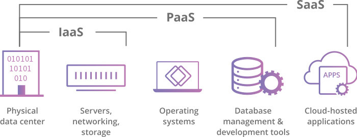

# 클라우드란?

## 클라우드(Cloud)란?

클라우드(Cloud)는 영문 그대로 '구름'이라는 듯을 가지고 있다. 컴퓨터 데이터를 로컬PC의 내부 디스크에 보관하지 않고 인터넷을 통해 중앙 컴퓨터에 저장할 수 있는데 이 공간을 클라우드라고 한다. 인터넷만 연결된다면 언제 어디서든 저장한 데이터를 가져올 수 있게 되는 것이다. 즉, 클라우드 서비스란, 인터넷 상에 자료를 저장해두고 사용자가 필요한 자료나 프로그램을 자신의 컴퓨터에 설치하지 않고도 인터넷을 통해 언제 어디서나 이용할 수 있는 서비스를 말한다.

클라우드는 네트워크 전체에서 확장 가능한 리소스를 추상화, 풀링 및 공유하는 IT 환경이다. 클라우드는 대개 해당 시스템 내에서 워크로드를 실행하는 동작인 클라우드 컴퓨팅을 지원하기 위해 구축된다. 클라우드와 클라우드 컴퓨팅 자체는 기술이 아니다.
* 클라우드는 애플리케이션이 실행되는 환경이다.
* 클라우드 컴퓨팅은 클라우드에서 워크로드를 실행하는 기능, 즉 동작을 말한다.
* 기술은 클라우드를 구축하고 사용하는 데 사용되는 소프트웨어와 하드웨어와 같은 것들이다.

 

## 클라우드 컴퓨팅이란?

클라우드 컴퓨팅(Cloud Computing)이란 인터넷 기반 컴퓨팅의 일종으로 정보를 자신의 컴퓨터가 아닌 클라우드에 연결된 다른 컴퓨터로 처리하는 기술을 말한다. 

클라우드는 네트워크를 통해 사용할 수 있고, 클라우드 컴퓨팅은 Client 단에서는 입/출력만 이루어지고, 정보 분석 및 처리, 저장, 관리, 유통 등의 작업은 클라우드 공간에서 이루어지는 형태로 동작한다. 따라서 사용자 단에서는 단순 입/출력만 하게 되므로 신경 쓸 것이 없다.

 *Cloud Computing Image*

 

## 클라우드의 장점

* 클라우드 서비스를 통해 저장된 자료를 쉽게 공유하고 전달 할 수 있다.
* 단순 데이터 저장을 넘어서 프로그램을 따로 설치하지 않아도 원하는 작업을 수행할 수 있고 여러 사람이 동시에 문서를 공유하며 작업도 가능하다.
* 기업들의 경우 선행투자 비용(서버구매)을 없앨 수 있다.
* 데이터 저장을 위한 서버 Infra 구축 등의 비용과 시간을 절약할 수 있어 진행하는 프로젝트의 핵심 부분에 좀 더 집중 할 수 있다.
* Infra 구축하고 유지하는 데에도 비용과 인력이 소모되지 않으며 빠른 처리 속도로 인한 쾌적한 환경에서 프로젝트를 진행할 수 있다.
* 서버의 확장도 유연하게 사용할 수 있으며 추가적인 확장 범위만큼만 비용을 지불하면 되니까 효율적이다.

 

## 클라우드의 서비스 종류

* 서비스로서의 인프라 (Infrastructure-as-a-Service, IaaS)
  * IaaS는 사용자에게 컴퓨팅, 네트워킹 및 스토리지 리소스를 제공한다.
  * 가장 기본적인 클라우드 서비스 모델로서, CPU코어, 메모리 용량, 하드디스크 등 컴퓨터 자원을 사용자의 needs에 맞게 제공해준다.
  * IaaS는 PaaS, SaaS의 기반이 된다.
  * 보통의 서버와 같이 어플리케이션을 설치하고 실행할 수 있다.
  * AWS Elastic Compute Cloud(EC2), Microsoft Azure, Google Compute Engine --- IT administrators
* 서비스로서의 플랫폼 (Platform-as-a-Service, PaaS)
  * PaaS는 애플리케이션을 실행할 수 있는 플랫폼과 플랫폼 실행에 필요한 IT 인프라를 제공한다.
  * 컴퓨터 자원에 플랫폼(개발 환경)까지 제공해주는 서비스이다. 즉 개발에 필요한 환경을 제공한다.
  * PaaS에서 제공하는 서비스를 선택하여 어플리케이션을 개발하면 된다.
  * PaaS 제공 업체는 필요한 API를 제공하여 편리하게 개발할 수 있도록 지원한다.
  * Heroku, AWS Elastic Beanstalk, Google App Engine --- Software Developers
* 서비스로서의 소프트웨어 (Software-as-a-Service, SaaS)
  * SaaS는 완벽히 작동하는 애플리케이션과 해당 애플리케이션을 실행하는 플랫폼, 플랫폼의 기반 인프라를 제공한다.
  * 소프트웨어까지 모두 제공해주는 서비스로, 사용자는 클라이언트 프로그램을 통해 간편하게 접근하고 사용하면 된다.
  * 즉, 사용자가 원하는 소프트웨어를 서비스로 한다.
  * Gmail, Trello, Salesforce CRM, EventPro, Office 365, Google Docs --- End Users
* 서비스로서의 기능 (Function-as-a-Service, FaaS)
  * FaaS는 이벤트 기반 실행 모델로서, 개발자가 인프라를 유지관리하지 않고도 애플리케이션 및 기능을 구축, 실행 및 관리할 수 있도록 지원한다.

 

## ⚡ 참조 
* <https://m.blog.naver.com/pst8627/221654211420>
* <https://www.cloudflare.com/ko-kr/learning/cloud/what-is-the-cloud/>
* <https://well-made-codestory.tistory.com/20>
* <https://aws.amazon.com/ko/what-is-cloud-computing/?nc2=h_ql_le_int_cc>

 
