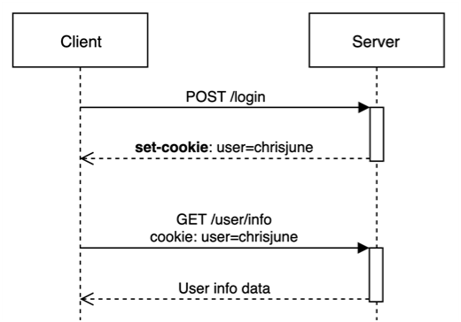
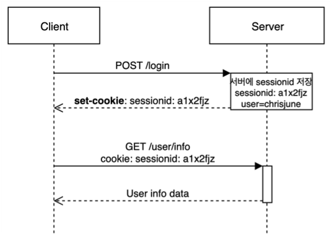

# 쿠키와 세션

## 쿠키(Cookie)란?

* 쿠키는 클라이언트(브라우저) 로컬에 저장되는 Key-Value쌍의 작은 데이터 파일이다.
* 클라이언트가 웹사이트를 방문할 경우 그 사이트가 사용하고 있는 서버에서 사용자의 컴퓨터에 저장하는 작은 기록 정보 파일이다. 클라이언트의 상태 정보를 피씨에 저장했다가 필요 시 정보를 참조하거나 재사용할 수 있다.
* 클라이언트가 페이지 요청 → 웹서버는 쿠키를 생성 → 생성한 쿠키에 정보를 담아 클라이언트에 돌려 준다
  * : 아이디와 비밀번호 저장, 오늘 이 창을 다시 보지 않기 등이 있다.
* 사용자가 사이트에 방문하면 데이터를 쿠키로 저장함, 하지만 모든 데이터를 저장하면 위험하다. 수정할 수 있는 중요한 정보들은 쿠키에 저장을 하면 안된다. 브라우저 종료해도 만료기간이 남아있으면 존재하기 때문이다.
* 구성 요소 : 쿠키 이름, 쿠키 값, 만료시간, 전송할 도메인명, 전송할 경로, 보안 연결 여부, Http Only 여부

 

## 세션(Session)이란?

* 브라우저가 종료되기 전까지 클라이언트의 요청을 유지하게 해주는 기술이다.
* 사용자 정보를 파일 브라우저에 저장하는 쿠키와 달리 세션은 서버 측에서 관리한다.
* 방문자가 웹서버에 접속해있는 상태이다. 웹 서버에 접속한 시점부터 웹 브라우저를 종료하여 연결을 끝내는 시점이다. 화면을 이동을 해도 로그인이 풀리지 않고 로그아웃하기 전까지 유지한다.
* 중요한 정보들은 세션으로 관리, 사용자가 직접 데이터 수정 불가, 어떤 데이터인지 식별하는 방법은 세션 아이디라는 기간이 짧은 인식키를 하나 발급해준다. 브라우저 종료 시 만료기간에 상관없이 종료한다.

 

## 쿠키(Cookie)와 세션(Session)의 큰 차이점

쿠키와 세션의 큰 차이점은  사용자의 정보가 저장되는 위치이다. 쿠키는 서버의 자원을 전혀 사용하지 않으며 세션은 서버의 자원을 사용한다. 세션이 쿠키를 이용하여 session-id만 저장하고 그것으로 구분하여 서버에서 처리하기 때문에 보안 면에서 더 우수하다. 속도 면에서는 쿠키에 정보가 있기때문에 서버에 요청 시 속도가 빠르다.

 

## ⚡ 참조 
* <https://devuna.tistory.com/23>

 
