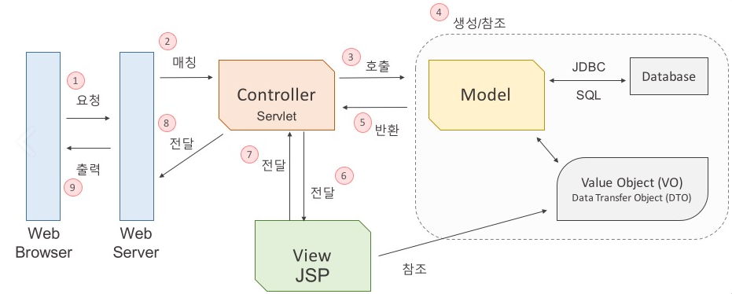

# MVC란?

## 디자인 패턴이란?

* 객체 지향 프로그래밍 설계를 할 때 자주 발생하는 문제들을 피하기 위해 사용되는 패턴이다.
* 소프트웨어를 설계할 때 특정 맥락에서 자주 발생하는 고질적인 문제들이 또 발생했을 때 재사용할 수 있는 훌륭한 해결책이다.
* 프로그램을 개발하는 과정에서 빈번하게  발생하는 디자인 문제를 정리해서 상황에 따라 간편하게 적용할 수 있게 정리한 것이다. 적지 않은 시간과 노력, 시행착오를 줄일 수 있다.
* 문제를 해결을 위해 가장 효과적인 방법이 '패턴'이라는 이름으로 자리잡았다.
* 디자인 패턴의 종류 참조 1 : <a href="https://coding-factory.tistory.com/708">https://coding-factory.tistory.com/708</a>
* 디자인 패턴의 정류 참조 2 : <a href="https://gmlwjd9405.github.io/2018/07/06/design-pattern.html">https://gmlwjd9405.github.io/2018/07/06/design-pattern.html</a>

 

## MVC란?

*Spring프레임워크와 JSP를 사용하는 웹 애플리케이션 개발에 많이 사용된다.*

MVC(Model-View-Controller) Pattern은 소프트웨어 공학에서 사용되는 소프트웨어 디자인 패턴 중 하나이다. 

MVC은 어플리케이션을 세 개의 영역으로 분할하고 각 구성 요소에게 고유한 역할을 부여하는 개발 방식이다.

즉, 개발 할 때, 3가지 형태로 역할을 나누어 개발한다는 것이다.

MVC 패턴을 도입하면 도메인(비즈니스 로직) 영역과 UI 영역이 분리되므로 서로 영향을 주지 않고 유지보수가 가능합니다.

비즈니스 처리 로직과 사용자 인터페이스 요소들을 분리시켜 서로 영향없이 개발하기 수월하다는 장점이 있다.

### 1. Model
* 어플리케이션이 "무엇"을 할 것인지 정의하는 부분으로 백그라운드에서 동작하는 비즈니스 로직(데이터)을 처리하기 위한 역할을 한다.
* 비즈니스 로직을 처리한 후 Model의 변경사항을 Controller와 View에 전달한다.
* 어플리케이션의 정보, 데이터를 나타낸다.
  - 데이터베이스, 처음의 정의하는 상수, 초기화 값, 변수 등을 뜻한다. 
  - 사용자가 편집하기를 원하는 모든 데이터를 가지고 있어야 한다.
* DATA, 정보들의 가공을 책임지는 컴포넌트이다. 즉, 데이터를 가진 객체를 모델이라고 한다. 데이터는 내부의 상태에 대한 정보를 가질 수도 있고, 모델을 표현하는 이름 속성으로 가질 수 있다.
* 변경이 일어나면, 변경 통지에 대한 처리방법을 구현해야만 한다.
* 처리되는 알고리즘, DB와 상호작용(CRUD), 데이터 등등

### 2. View
* 화면이 "무엇"인가를 "보여주기 위한 역할"을 한다.
* 사용자에게 보여지는 부분(화면), 즉 유저 인터페이스(User Interface)를 의미한다.
* 사용자와 상호작용을 하며 Controller로부터 받은 Model의 결과값을 사용자에게 화면으로 출력하는 일을 한다.
* 컨트롤러 하위에 종속되어, 모델이나 컨트롤러가 보여주려고 하는 모든 필요한 것들을 보여준다.
* 모델에게 전달 받은 데이터를 별도로 저장하지 않는다.
* Model과 View는 서로의 존재를 모른다.
* 사용자가 화면에 표시된 내용을 변경하게 되면 Model에게 전달하여 Model을 변경해야 한다.

### 3. Controller
* 모델이 "어떻게" 처리할 지를 알려주는 역할을 할 것이고, 모바일에서는 화면의 로직 처리 부분이다.
* Model과 View를 중재하기 위해 Model과 View가 각각 무엇을 해야 할 지를 알고 있고 통제한다.
  - Model이나 View는 서로의 존재를 모르고 있기 때문에 비즈니스 로직을 처리하는 Model과 완전히 UI에 의존적인 View가 서로 직접 이야기 할 수 없다. 즉, 사용자로부터의 입력을 받고 Model 또는 View 중개인 역할이다.
* 사용자가 어플리케이션을 조작하여 발생하는 변경 이벤트를 처리하는 역할을 수해안다.
* 모델이나 뷰로부터 변경 내용을 통지 받으면 이를 각 구성 요소에게 통지해야 한다.
  - 화면에서 사용자의 요청을 받아서 처리되는 부분을 구현되게 되며, 요청 내용을 분석해서 Model과 View에 업데이트 요청을 한다.
  - 사용자로부터 View에 요청이 있으면 Controller는 해당 업무를 수행하는 Model을 호출하고 Model이 업무를 모두 수행하면 다시 결과를 View에 전달하는 역할을 한다.

 

## MVC의 한계

MVC에서 View는 Controller에 연결되어 화면을 구성하는 단위 요소이므로 다수의 View들을 가질 수 있다. 그리고 Model은 Controller를 통해서 View와 연결되어지지만, 이렇게 Controller를 통해서 하나의 View에 연결될 수 있는 Model도 여러개가 될 수 있다. 즉, 화면에 복잡한 화면과 데이터의 구성 필요한 구성이라면, Controller에 다수의 Model과 View가 복잡하게 연결되어 있는 상황이 생긴다. 

 

## ⚡ 참조 
* <a href="https://velog.io/@seongwon97/MVC-패턴이란">https://velog.io/@seongwon97/MVC-패턴이란</a>
* <a href="https://osy0907.tistory.com/63">https://osy0907.tistory.com/63</a>
* <a href=" https://coding-factory.tistory.com/69"> https://coding-factory.tistory.com/69</a>

 
