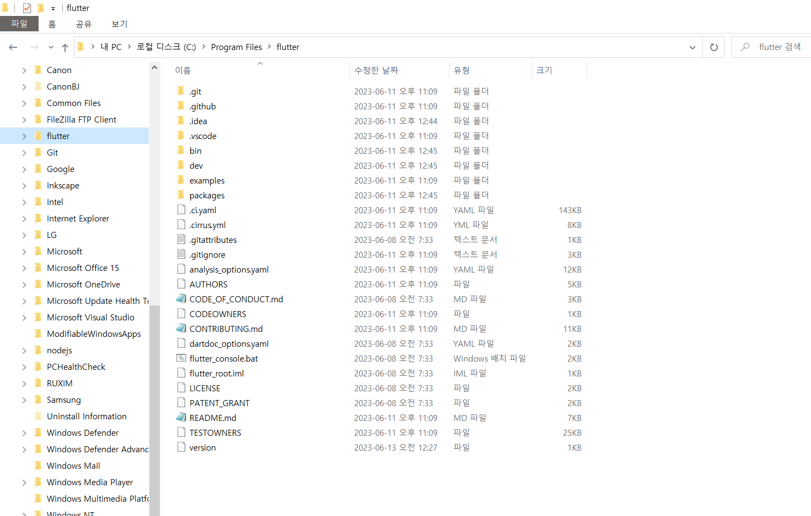

# Flutter Project 시작하기


## Flutter SDK 설치하기

<https://flutter.dev/>

1) <https://docs.flutter.dev/get-started/install>에 들어가 내 pc에 맞는 os를 선택하여 설치하면 된다. 'flutter_windows_3.10.4-stable.zip' 버튼 클릭 후 다운받고 원하는 위치에 파일을 합축해제 한다.

    

    

    

2) flutter를 다운받았다고 바로 사용할 수 있는 것이 아니라 flutter를 실행할 수 있게 시스템 환경 변수에 경로(Path)를 지정해줘야 한다.
    * 검색 -> 제어판 -> 고급 시스템 설정 보기 -> 고급 -> 환경변수 -> Path -> 편집 -> 편집
    * 압축해제 한 flutter의 전체 경로 및 하위 폴더인 bin 경로까지 함께 추가해줘야 한다.

    

<br>

## vsCode 설치하기

<https://code.visualstudio.com/Download>

<br>

## 안드로이스 스튜디오 설치 

1) <https://developer.android.com/studio>에서 안드로이드 스튜디오를 다운받고 다운받은 exe 파일을 실행시켜서 안드로이드 스튜디오를 실행한다.

2) 실행된 안드로이드 스튜디오에 플러터와 다트 플러그인을 설치하고 안드로이드 스튜디오를 restart하면 'New Flutter Project' 버튼이 생긴 것을 확인할 수 있다. 

    

    

Flutter SDK Path에 맨처음에 설치한 flutter 경로를 넣어준다.

    

3) 안드로이드 스튜디오의 Settings -> System Settings -> Android SDK에서 SDK Tools를 설치해줘야 한다. 필요한 SDK Tool를 설치하고 환경 변수 편집에 경로(Path)를 추가해준다.

    

    

<br>

## 플러터 프로젝트 시작하기 (w/VsCode)

1)

```
flutter create [프로젝트 이름]
```


2)

```
cd flutter_ohbob
flutter run
```


3) 

```
flutter doctor
```

 *Visual Studio Code를 사용할 것이기에 Visual Studio는 따로 설치를 해주지 않았다. 나머지는 다 PASS!*

<br>

## ⚡참고
* How To Install Flutter For Windows - Build Flutter Apps 1 - [Youtube View](https://www.youtube.com/watch?v=VFDbZk2xhO4&list=PLCC34OHNcOtpx9qCZNv-NbIT1Gx3BAOku&index=1)
* First Flutter App On Android - Build Flutter Apps 2 - [Youtube View](https://www.youtube.com/watch?v=p7MkQHfVbcQ&list=PLCC34OHNcOtpx9qCZNv-NbIT1Gx3BAOku&index=2)
* <https://blockdmask.tistory.com/420> -- 플러터와 안드로이드 스튜디오 설치 총정리
* <https://blog.naver.com/mingjooo_/222976806429> -- VSCode에서 Flutter(플러터) 설치
* <https://calvinjmkim.tistory.com/60> - 플러터 설치 및 환경설정 에러 해결
* <https://blog.naver.com/mingjooo_/222976806429> - Android toolchain 등 에러 해결

<br>
