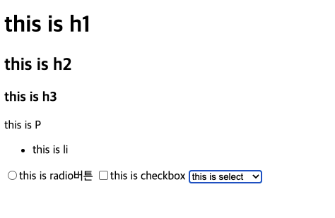
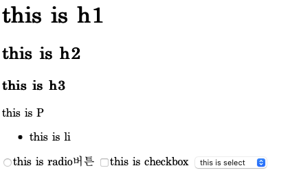
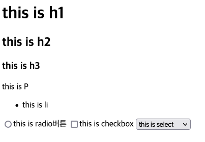

# reset.css와 normalize.css

## 크로스 브라우징이란?

"웹 사이트를 접속했을 때 어느 한쪽에만 최적화됨을 막기 위해 공통 요소를 사용해서 제작하는 것이다."

페이지를 만들다 보면 속성을 주지도 않았는데 margin, padding 속성이 부여돼서 화면이 깨지는 경우가 있다. 이것은 브라우저마다 HTML 시맨틱 태그에 대한 기본값이 다르기 때문이다. 이 차이를 없애기 위해 (크로스 브라우징을 위해) 필요한 것이 가장 잘 알려진 reset CSS, normalize CSS등이다. 

 *크롬*

 *사파리*

 *파이어폭스*

 

## reset CSS란?

* 웹 브라우저마다 다른 default 스타일이 지정되어 있는데 해당 값을 초기화 함으로써 다양한 웹 브라우저에서도 동일한 스타일이 적용되도록 하는 설정 파일이다.
* 실무에서 편의에 의해 임의로 지저하는 설정값이다.
* 제일 많이 사용되는 reset CSS
* <https://meyerweb.com/eric/tools/css/reset/index.html>

 

## normalize CSS란?

* 브라우저(모바일 브라우저를 포함)를 광범위하게 지원하며, HTML5 요소, 타이포그래피, 목록(lists). embeded 콘텐츠, 폼과 테이블을 일관성 있게 통일시키는 CSS다.
* 사용하기 좋은 기본값들은 유지한다.
* HTML 요소의 다양한 스타일을 정규화한다.
* 버그 및 브라우저 간 차이점을 수정한다.
* 부분적인 개선과 가용성을 향상시킨다.
* 코드에 대한 자세한 주석이 달려있다.
* cdn 기법으로 <head> 태그 안에 링크로 적용할 수 있다.
* <https://cdnjs.com/libraries/normalize>

 

## ⚡ 참조
* <https://parkjh7764.tistory.com/80>
* <https://velog.io/@cjy0029/Normalize-Reset-뭘써야-할까>

 
