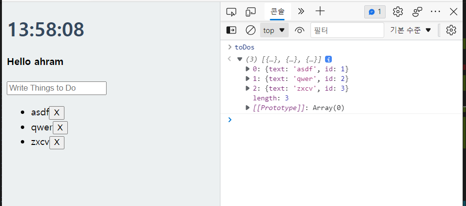
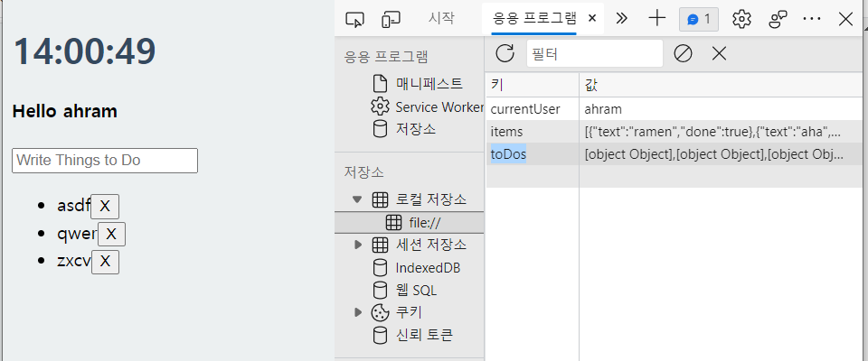
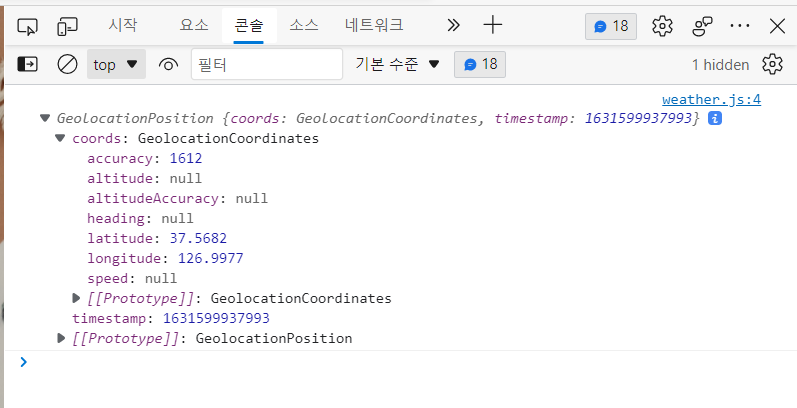
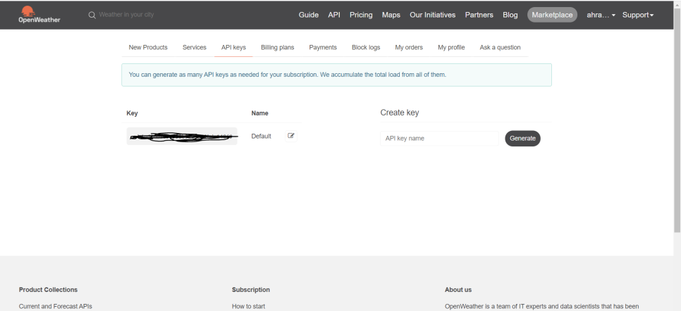

# [Nomad Coder] 크롬 앱 만들기

**A clone of the productivity chrome app 'momentom' on Vanilla JS**

<https://nomadcoders.co/javascript-for-beginners>

<https://github.com/byahram/2022-webs/tree/main/study/javascript/NomadCoderVanilaJS>

<br>

## Vanilla JS로 크롬 앱 만들기 #1

### 1-1. Why JS?

자바스크립은 바꿀 수도 없고 업데이트하지도 못하므 우리가 원하는 것으로 교체할 수 없다. 그러나 JavaScript은 웹에서 쓸 수 있는 하나뿐인 언어이기 때문에 웹이 빠르게 발전할 때 JavaScript도 같이 빨리 발전한다.

왜 프론트엔드에서 자바스크립을 사용할까? 만들고 다른 언어로 변경하지 않기 문이다. 전 세계에 있는 컴퓨터들이 자바스크립을 쓰기 시작했다. 모든 컴퓨터에는 브라우저가 있고 브라우저는 JavaScript 돌아가 즉 모든 컴퓨터는 JavaScript 이해하는 이유이다.

### 1-2. Super Powers of JS

<https://threejs.org/>

### 1-3. ES5, ES6, ES... WTF!?!?!

### 1-4. VanillaJS

<!-- <http://vanilla-js.com/> -->

### 1-5. Hello World with JavaScript

### 1-6. Your First JS Variable(변수!)
- 변수를 생성하고
- 생성한 변수를 Initialize하고
- 그 후에 사용

```javascript
let a = 221; // a란 변수를 생성하고 221으로 Initialize
let b = a - 5; // a 변수 사용
```

### 1-7. let, const, var
- let
  - 중복 선언이 불가능하다. - 이미 존재하는 변수와 같은 이름의 변수를 또 선언하면 에러가 난다.
  - 값의 재할당이 가능한 변수
  - 변수 선언시 초기값을 주지 않아도 된다.
  - 블럭 레벨 스코프 - 함수 내부는 물론, if문이나 for문 등의 코드 블럭 {...}에서 선언된 변수도 지역 변수로 취급한다.
- const
  - 중복 선언이 불가능하다. - 이미 존재하는 변수와 같은 이름의 변수를 또 선언하면 에러가 난다.
  - 값의 재할당이 불가능한 상수
  - 반드시 초기값을 할당해야 한다.
  - 블럭 레벨 스코프 - 함수 내부는 물론, if문이나 for문 등의 코드 블럭 {...}에서 선언된 변수도 지역 변수로 취급한다.
- var
  - 중복 선언이 가능하다. - 이미 선언되어있는 이름과 같은 이름으로 변수를 또 선언해도 에러가 나지 않는다.
  - 값의 재할당이 가능한 변수
  - 변수 선언시 초기 값을 주지 않아도 된다.
  - 함수 레벨 스코프 - 함수 내부에 선언된 변수만 지역변수로 한정하며, 나머지는 모두 전역변수로 간주한다.
- 함수 레벨 스코프 var의 경우 버그 발생과 메모리 누수의 위험 등이 있기 때문에 var말고 let, const를 사용하는 것이 좋다.

### 1-8. Data Types on JS
- //, /\*\*/ - comments
- 변수는 const로 필요할때만 let으로
- " " - string
- true = 1 / false = 0

### 1-9. Organizing Data with Arrays
```javascript
const monday = "Mon";
const tue = "Tue";
const wed = "Wed";
const thu = "Thu";
const fri = "Fri";

const daysOfWeek = ["Mon", "Tue", "Wed", "Thu", "Fri", "Sat", "Sun"];

console.log(daysOfWeek); // ['Mon', 'Tue', 'Wed', 'Thu', 'Fri', 'Sat', 'Sun'];
console.log(daysOfWeek[2]); // Wed
```

### 1-10. Organizing Data with Objects
```javascript
const nicoInfo = ["Nicolas", "55", true, "Seoul"];        // Array
console.log(nicoInfo);

// Objects
const nicoInfo = {
    name: "Nico",
    age: 33,
    gender: "Male",
    isHandsome: true,
    favMovies: ["Along the gods", "LOTR", "Oldboy"];
    favFood: [
        {
            name: "Kimchi", fatty: false
        },
        {
            name: "Cheese burger",
            fatty: true
        }
    ]
}
console.log(nicoInfo.gender);        // Male

nicoInfo.gender = "Female"
console.log(nicoInfo.gender);        // Female


console.log(nicoInfo);
/* { name: 'Nico',
  age: 33,
  gender: 'Male',
  isHandsome: true,
  favMovies: ['Along the gods', 'LOTR', 'Oldboy'];
  favFood: [{ name: 'Kimchi', fatty: false },
            { name: 'Cheese burger', fatty: true } ]
} */

console.log(nicoInfo.favFood[0].fatty);        // false
```

<br>

## Vanilla JS로 크롬 앱 만들기 #2

### 2-1. Your First JS Function
```javascript
function sayHello() {
  console.log("Hello!");
}
sayHello(); // Hello!

// with Arguments, Parametes
function sayHello(name) {
  console.log("Hello!", name);
}
sayHello("Nicolas"); // Hello! Nicolas

// with Arguments, Parametes
function sayHello(name, age) {
  console.log("Hello!", name, " you have ", age, " years of age.");
}
sayHello("Nicolas", 15); // Hello! Nicolas you have 15 years of age.
```

### 2-1-1. More Function Fun
- ""
- ''
- `` (backtick)

```javascript
function sayHello(name, age) {
  console.log(`Hello ${name} you are ${age} years old`);
}
sayHello(); //    Hello Nicolas you are 15 years old

function sayHello(name, age) {
  return `Hello ${name} you are ${age} years old`;
}
const greetNicolase = sayHello("Nicolas", 14);
console.log(greetNicolas); // Hello Nicolas you are 14 years old

const calculator = {
  plus: function (a, b) {
    return a + b;
  },
};
const plus = calculator.plus(5, 5);
console.log(plus);
```

### 2-2. JS DOM Functions
- DOM (Document Object Module) : HTML을 DOM객체로 바꿀 수 있다.

```javascript
<h1 id="title">This works!</h1> // HTML
```

```javascript
const title = document.getElementById("title");
console.log(title); // This works!

title.innerHTML = "Hi! From JS";
<h1 id="title">Hi! From JS</h1>;
```

### 2-3. Modifying the DOM with JS
- JS로 document의 객체 등을 수정할 수 있다.
- querySelector은 노드의 첫번째 자식을 반환한다.

```javascript
<h1 id="title">This works!</h1> // HTML
```

```javascript
const title = document.getElementById("title");

title.innerHTML = "Hi! From JS";
title.style.color = "red";
document.title = "I own you";

console.dir(document);

const title2 = document.querySelector("#title");
// id -> #
```

### 2-4. Events and Event Handlers
- Event: 웹사이트에서 발생하는 이벤트 (ex. click, resize, submit, input, change, before, printing...)

```javascript
function handleResize() {
  console.log("I have been resized");
}
window.addEventListener("resize", handleResize); // call 'handleResize' function

function handleResize(event) {
  console.log(event);
}
window.addEventListener("resize", handleResize);

function handleClick() {
  title.style.color = "red";
}
const title = document.querySelector("#title");
title.addEventListener("click", handleClick);
```

### 2-5. 조건문 : If, else, and, or
- && : two or more conditions should be true

  - true && true = true;
  - false && true = false;
  - true && false = false;
  - false && false = false;

- \|\| : at least one condition should be true
  - true \|\| true = true;
  - false \|\| true = true;
  - true \|\| false = true;
  - false \|\| false = false;

```javascript
if (condition) {
  block; // if condition is true
} else {
  block; // if condition is false
}
```

```javascript
const age = prompt("How old are you"); // prompt는 더이상 사용하지 않는다.

if (age > 18) {
  console.log("you can drink");
} else {
  console.log("you cant");
}

if (age >= 18 && age <= 21) {
  console.log("you can drink but you should not");
} else if (age > 21) {
  console.log("go ahead");
} else {
  console.log("TOO YOUNG");
}
```

### 2-6. DOM If else Function Practice
```javascript
const title = document.querySelector("#title");

const BASE_COLOR = "#34495e";
const OTHER_COLOR = "#7f8c8d";

function handleClick() {
  console.log(title.style.color);
  const currentColor = title.style.color;
  if (currentColor == BASE_COLOR) {
    title.style.color = OTHER_COLOR;
  } else {
    title.style.color = BASE_COLOR;
  }
}

function init() {
  title.style.color = BASE_COLOR;
  title.addEventListener("click", handleClick);
}

init();
```

<https://developer.mozilla.org/ko/docs/Web/Events>

```javascript
function handleOffLine() {
  console.log("bye bye");
}

function handleOnline() {
  console.log("Welcome back");
}

window.addEventListener("offline", handleOffLine); // wift off
window.addEventListener("offline", handleOnline); // wift on
```

### 2-7. DOM If else Function Practice part 2
- className gets and sets the value of the class attribute of the specified element

```javascript
const title = document.querySelector("#title");
const CLICKED_CLASS = "clicked";

function handleClick() {
  const currentClass = title.className;

  if (currentClass !== CLICKED_CLASS) {
    title.className = CLICKED_CLASS;
  } else {
    title.className = "";
  }
}

function init() {
  title.addEventListener("click", handleClick);
}
init();
```

```javascript
CONST hasClass = title.classList.contains(CLICKED_CLASS);
if(!hasClass) {
    title.classList.add(CLICKED_CLASS);
} else {
    title.classList.remove(CLICKED_CLASS);
}

// 위와 같은 코드와 같은 역할을 해주는 toggle
title.classList.toggle(CLICKED_CLASS);
```

<br>

## Vanilla JS로 크롬 앱 만들기 #3

### 3-1. Making a JS Clock part1
```javascript
const date = new Date(); // get a current date
const minutes = date.getMinutes(); // get a minute from current date
const hours = date.getHours(); // get an hour from current date
const seconds = date.getSeconds(); // get a second from current date
```

### 3-2. Making a JS Clock part2
```javascript
setInterval(getTime, 1000); // getTime을 1000 miliseconds(1초)마다 실행한다.
setTimeout();
```

- 자바스크립트로 주기적인 작업을 실행하기 위해서 setInterval과 setTimeout 메소드를 사용한다.
- setInterval
  - 일정한 시간 간격으로 작업을 수행하기 위해 사용한다.
  - clearInterval을 사용하여 중지한다.
  - 일정한 시간 간격으로 실행되는 작업이 그 시간 간격보다 오래 걸릴 경우 문제가 발생할 수 있다.
- setTimeout
  - 일정한 시간 후에 작업을 한 번 실행한다.
  - 재귀적 호출을 사용하여 작업을 반복한다.
  - 지정된 시간을 기다린 후 작업을 수행하고, 다시 일정한 시간을 기다린 후 작업을 수행한다.
  - clearTImeout을 사용하여 작업을 중지한다.
- If seconds is less than 10, it will show -> 0${seconds)

```javascript
clockTitle.innerText = `${hours}:${minutes}:${
  seconds < 10 ? `0${seconds}` : seconds
}`;
```

### 3-3. Saving the User Name part1


```javascript
// USER_LS의 ITEM을 로컬저장소에서 가져오기
const USER_LS = "currentUser";
const currentUser = localStorage.getItem(USER_LS);
```

### 3-4. Saving the User Name part2


```javascript
localStorage.setItem(USER_LS, text); // save to localStorage
const currentUser = localStorage.getItem(USER_LS); // get item info from localStorage
```

### 3-5. Making a To Do List part1
Similar to #3-2, #3-3

### 3-6. Making a To Do List part2


```javascript
const toDoObj = {
  text: text,
  id: toDos.length + 1,
};
toDos.push(toDoObj);
```



```javascript
localStorage.setItem(TODOS_LS, JSON.stringify(toDos));
```

- JSON : JavaScript Object Notation의 Abbreviation
- JSON.stringify() : Object를 string으로 바꾸는

### 3-7. Making a To Do List part3
```javascript
return toDo.id !== parseInt(li.id);
```

- toDo.id는 num, li.id는 string -> 둘다 num으로 맞춰준 후 비교

```javascript
const cleanToDos = toDos.filter(function (toDo) {
  console.log(toDo.id, li.id); // toDo.id는 num, li.id는 string
  return toDo.id !== parseInt(li.id);
});
toDos = cleanToDos;
saveToDos();
```

- 리스트를 삭제한 수 toDos를 대체해주고 저장

### 3-8. Image Background
```javascript
// JAVASCRIPTS

function getRandom() {
  const number = Math.floor(Math.random() * 8);
  return number;
}

function init() {
  const randomNumber = getRandom();
}
```

- get a random number 0 to 8

```css
// CSS

@keyframes fadeIn {
  from {
    opacity: 0;
  }
  to {
    opacity: 1;
  }
}

.bgImage {
  position: absolute;
  top: 0;
  left: 0;
  width: 100%;
  height: 100%;
  z-index: -1;
  animation: fadeIn 0.5s linear;
}
```

### 3-9. Getting the Weather part1 - Geolocation
- saveCoords는 currentName(userName), toDos 저장하는 법과 같다.

```javascript
function handleGeoSuccess(position) {
  console.log(position);
}

function handleGeoFailed() {
  console.log("Cant get geo location!!");
}

function askForCoords() {
  // get my current position(location)
  navigator.geolocation.getCurrentPosition(handleGeoSuccess, handleGeoFailed);
}
```



### 3-10. Getting the Weather part2 - API
- Using Open Weather API
  - <https://openweathermap.org/>
- after sign up and sign in, then get a API Keys
  
- API (Application Programming Interface)는 다른 서버로부터 손쉽게 데이터를 가져올 수 있는 수단이며 오로지 데이터만 가져온다.
- fetch() : 안에는 가져올 데이터가 들어가면 되고, 따옴표가 아닌 backtick(`)을 사용한다

```javascript
fetch(
  `https://api.openweathermap.org/data/2.5/weather?lat=${lat}&lon=${lon}&appid=${API_KEY}`
);
```


```javascript
fetch(
  `http://api.openweathermap.org/data/2.5/weather?lat=${lat}&lon=${lon}&appid=${API_KEY}&units=metric&lang=kr`
)
  .then(function (response) {
    return response.json();
  })
  .then(function (json) {
    const temp = json.main.temp;
    const place = json.name;
    weather.innerHTML = `${temp}˚ at ${place}`;
  });
```

- fetch() 함수를 실행한 후 then을 실행한다.

<br>
